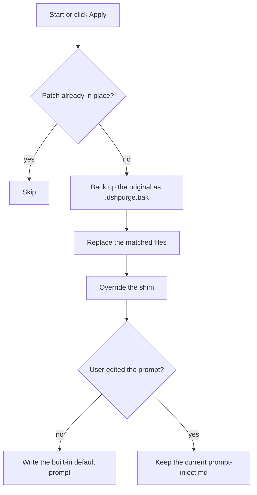
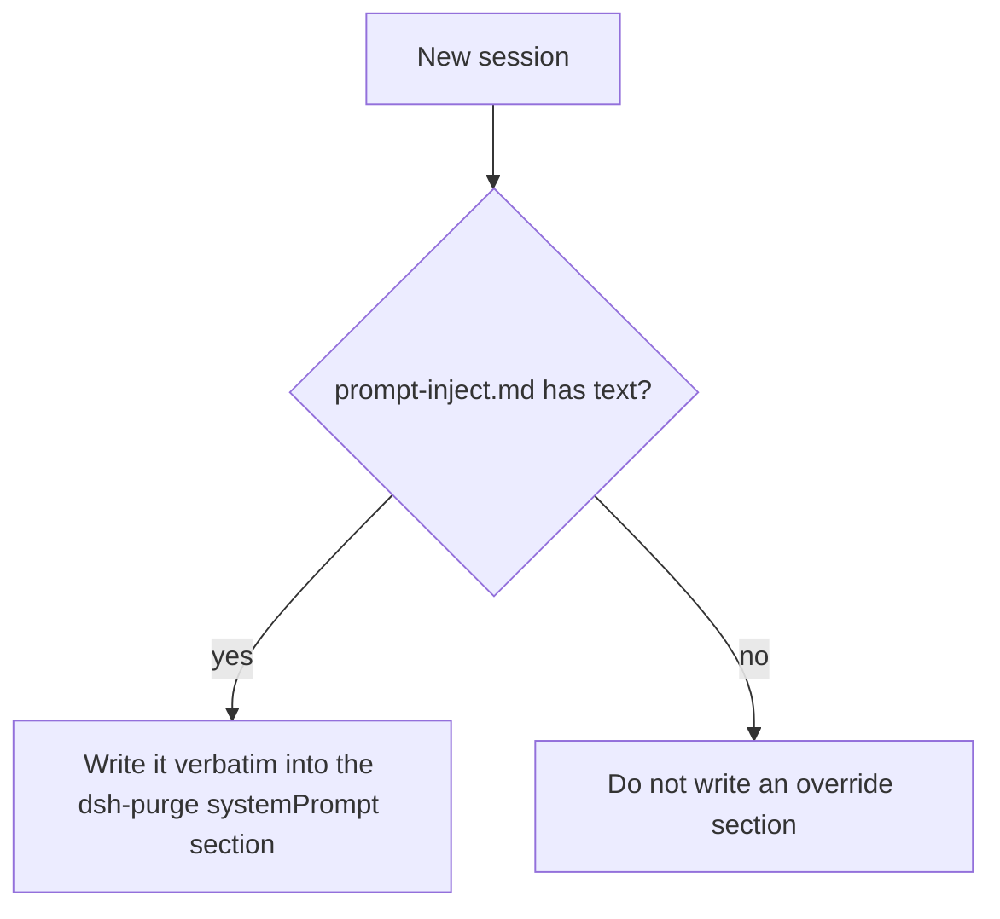
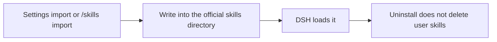

<p align="center">
  
</p>

<h1 align="center">⚔️ DeepSeek Harness cybersecurity red-team tool (dsh-purge)</h1>

<p align="center"><strong>Version 1.1.21</strong></p>

<p align="center">
  <em>Local official DeepSeek Harness cybersecurity red-team plugin. Evaluate and adjust host safety policy on a controlled local install; swap prompts per model. Default prompt for Chinese models — 小码酱. Please star ⭐</em>
</p>

<p align="center">
  <a href="https://github.com/YuJunZhiXue/dsh-purge/stargazers"></a>
  <a href="https://github.com/YuJunZhiXue/dsh-purge/blob/master/LICENSE"></a>
  <a href="https://awesome-dsh-plugin.com"></a>
  <a href="https://deepseek.stream/plugins/dsh-purge"></a>
  <a href="https://www.deepseek.com/harness/"></a>
  <br>
  
  
</p>

<p align="center">
  <a href="README.md">English</a> | <a href="README.zh-CN.md">中文</a>
</p>

> **After Apply, you must click Restart or the inject does not take effect.** Apply only writes the prompt and patches to disk. This process is still the old one. When the host has restarted, start a new chat — that is when the inject enters the session. Apply alone looks like nothing was injected.

> Current target is **dsh 0.1.7-rc.2**. The previous target, **0.1.7-rc.1** (including `0.1.7-rc.1.20260924.1`), still matches (Node.js **≥18**; Windows no-flash import hooks need **Node ≥22** `registerHooks`, older Node still gets file-level `windowsHide` patches). Patterns from older host builds that no longer exist are not applied. On other versions, unmatched originals stay pending or skipped. Nothing is rewritten blindly. Also accepts the 0.1.2 community `dsh-persona text` field and `dsh-mnemon` v0 session `summary`. After install you still need **Apply + restart**.
>
> Hub page is for reading only: [DeepSeek Harness Hub](https://deepseek.stream/plugins/dsh-purge). Do not install via `deepseek.stream/api/plugins/download?...`.

## Contents

- [What this is](#what-this-is)
- [Install](#install)
- [Preview](#preview)
- [Usage](#usage)
- [How it works](#how-it-works)
- [Restore](#restore)
- [Releases](#releases)

---

## What this is

**dsh-purge** is a cybersecurity red-team plugin for the official [DeepSeek Harness](https://www.deepseek.com/harness/) already installed on your machine.

Harness does more than forward a prompt. It rewrites prompts, approval gates, sandbox policy, and session migration at runtime. Asking only “will the model answer” treats a host-layer block as a model refusal. This plugin separates those two layers on your own install, for controlled evaluation and for seeing which default policy is too tight.

| You get | What it does |
|---|---|
| **Rules** | Grouped patch status, Apply / Restore / Uninstall, prompt editor, multiple rule sets |
| **Host policy** | Default copy, permission policy, and tool limits. Official capabilities stay. No second invented identity |
| **On start** | Checks and reapplies. After npm overwrites `node_modules`, you do not hand-edit files |

No hardcoded drive letters. It looks at `$DSH_HOME`, `.dsh` next to the dsh launcher, then `~/.dsh`. It does not patch the Harness source tree. **Apply** on the settings page is what writes the changes. Identity comes only from your `prompt-inject.md`.

It only touches the official `@deepseek-ai` packages and local config on the user's machine. It is not a public scanner and not an attack kit for third-party sites. The repo does not ship malware, unauthorized-exploit scripts, or payloads aimed at the public internet.

---

## 📌 非盈利公益项目，严禁任何主体用于商业售卖、付费倒卖或黑灰产牟利，仅供技术参考。

---

<a id="strict-legal--compliance-disclaimer"></a>

<div>

### ⚠️ <font color="red">Strict legal and compliance disclaimer</font>

<font color="red">

**Disclaimer:** This is a non-profit open-source project. It follows applicable laws and the rules of the platforms it uses, and is intended only for learning and research. Do not use it for any illegal or non-compliant purpose; the user bears any resulting consequences.

**Zero-tolerance statement:** This project opposes and forbids any illegal activity. The authors do not support, encourage, or assist unauthorized network attacks, exploit use, data theft, unlawful intrusion into computer information systems, or generation of illegal or prohibited content. **Anyone who uses this project for crime is solely responsible under the law. The authors have no liability.**

1. **This repository contains no illegal material.** The published code, docs, patches, and default prompt are **not** malware, backdoors, unauthorized pentest kits, ransomware, credential-stuffing scripts, or attack payloads aimed at the public internet or third-party systems. The project does not supply illegal content and does not incite, organize, or assist crime.
2. **Local official Harness only.** Security-eval patches and prompt injection run only on the **official DeepSeek Harness already installed on the user's machine** (`@deepseek-ai` packages, local profile / `$DSH_HOME`). The target is the user's own official local software, **not** someone else's website, server, account, or information system.
3. **Eval patches do not attack the public internet.** Apply, inject, revert, and uninstall stay in local files and local processes. They **do not scan, probe, intrude, or send attack traffic to any public host or unauthorized system**. Do not use this project as a jump host against the public internet. If "check for updates" is on, the plugin may only contact this plugin's own GitHub repository to compare versions. That is **not** an attack on third-party systems and is **not** authorization to penetrate anything.
4. **Lawful, controlled scope.** This project is an aid for red-team research and robustness evaluation on an **official Harness the user is entitled to administer**. **Do not run it against targets without the owner's lawful written authorization, public online systems, or production workloads.** Testing must stay on the **authorized local official Harness, offline local synthetic fixtures, authorized cybersecurity ranges, and compliant lab environments**.
5. **Forbidden uses.** Users must not use this project, directly or indirectly, to violate the following (each must be followed; no excuse to evade):
   - <font color="red"><strong>Criminal Law of the People's Republic of China</strong></font>
   - <font color="red"><strong>Cybersecurity Law of the People's Republic of China</strong></font>
   - <font color="red"><strong>Data Security Law of the People's Republic of China</strong></font>
   - <font color="red"><strong>Personal Information Protection Law of the People's Republic of China</strong></font>
   - and other applicable laws, regulations, and supervisory rules;
   - Also forbidden:
   - Unauthorized intrusion or attacks on public or private computer information systems; extortion, sabotage, credential stuffing, or spreading malicious payloads;
   - Inducing, generating, or spreading any content the law forbids, including threats to national security, terrorism, violence, pornography, gambling, fraud, and privacy or intellectual-property infringement;
   - Violating the model provider's terms of service and acceptable-use policy.
6. **The user bears all responsibility.** The project is provided under the MIT license as-is. The authors make no warranty of completeness, security, or fitness. **Users independently bear all civil, administrative, and criminal liability** for download, deploy, run, modify, distribute, and all resulting inputs and outputs. Authors and contributors bear no direct, indirect, or joint liability for abuse.
7. **The license ends on breach.** Anyone who uses this project for illegal attacks, malicious activity, or other violations has their open-source license **automatically and irrevocably terminated** from the moment of the violation. They must stop using the project, permanently destroy all copies and derivatives, and accept legal sanctions.
8. **No affiliation.** This is an independent open-source security-eval research project. It has no employment, commercial, authorization, or endorsement relationship with DeepSeek or its affiliates. "Official" here only means the eval target is the official DeepSeek Harness package on the user's machine. It does **not** mean DeepSeek developed, approved, or warrants this plugin.

</font>

</div>

---

## Install

Web, community Desktop, and the official desktop EXE are **installed and patched separately**. Install only the host you have open.

| What you run | Profile | Go to |
|---|---|---|
| Official `dsh web` | `web` | [Web](#web) |
| Community [DSH Desktop](https://github.com/anywhere-labs/dsh-desktop) | `desktop` | [Community Desktop](#desktop) |
| Official Harness desktop EXE | `default` | [Official desktop EXE](#official-exe) |

If `dsh` is not on PATH, or you do not want a remote install, use [Manual install](#manual).

### After the command: three steps

Adding the plugin to a profile does **not** patch `@deepseek-ai` by itself.

1. **Quit and reopen** the host you just installed into. Stop `dsh web` and start it again, or quit the Desktop tray and open that app's exe.
2. On **that host's** Settings page, wait until **Rules** appears, then click **Apply**. Ctrl+F5 if the page is cached.
3. **Restart once more** when prompted. Patched files load on that next start. Restart happens only when you click it.

Web **Apply / Restart / Uninstall** affect Web only. Desktop controls affect the desktop app only and do not launch `dsh web`. Do not Apply one host from the other.

<a id="web"></a>

### Web

Official `dsh` must be on PATH. If it is not, install the official CLI or use manual install.

```sh
dsh plugin --profile web add https://github.com/YuJunZhiXue/dsh-purge/archive/refs/heads/master.tar.gz
```

If this directory is already a clone:

```sh
dsh plugin --profile web add .
```

Then follow the three steps above and click **Apply** on the **Web** Settings page.

<a id="desktop"></a>

### Community Desktop

Open [DSH Desktop](https://github.com/anywhere-labs/dsh-desktop) and run this in the **built-in terminal**. That `dsh` is the desktop wrapper; its default profile is `desktop`.

```sh
dsh plugin add https://github.com/YuJunZhiXue/dsh-purge/archive/refs/heads/master.tar.gz
```

Do not use official `dsh plugin --profile desktop` on PATH (it is rejected). Do not use `dsh://` (that protocol belongs to the official EXE).

Then quit the tray, reopen `DSH Desktop.exe`, and click **Apply** on the **desktop** Settings page.

For a custom install folder, set `$exe` in the script to `DSH Desktop.exe` in that folder. The tarball URL is the source so a local path with spaces cannot split the command.

<details>
<summary><strong>Install from system PowerShell</strong></summary>

Find `DSH Desktop.exe` from the running process or the default locations below. Do not scan the whole disk.

```powershell
$zip = "https://github.com/YuJunZhiXue/dsh-purge/archive/refs/heads/master.tar.gz"
$exe = (Get-Process -Name "DSH Desktop" -ErrorAction SilentlyContinue | Select-Object -First 1 -ExpandProperty Path)
if (-not $exe) {
  $exe = @(
    "$env:LOCALAPPDATA\Programs\DSH Desktop\DSH Desktop.exe",
    "$env:ProgramFiles\DSH Desktop\DSH Desktop.exe",
    "${env:ProgramFiles(x86)}\DSH Desktop\DSH Desktop.exe"
  ) | Where-Object { Test-Path -LiteralPath $_ } | Select-Object -First 1
}
if (-not $exe) { throw "DSH Desktop.exe not found. Start the app, or set `$exe` to the exe in the install folder." }
$cli = @(
  (Join-Path (Split-Path $exe) "resources\app\lib\desktop-cli.js"),
  (Join-Path (Split-Path $exe) "resources\app.asar.unpacked\lib\desktop-cli.js")
) | Where-Object { Test-Path -LiteralPath $_ } | Select-Object -First 1
$env:ELECTRON_RUN_AS_NODE = "1"
$env:DSH_DESKTOP_DEFAULT_PROFILE = "desktop"
& $exe --expose-internals $cli plugin add $zip
```

</details>

<a id="official-exe"></a>

### Official desktop EXE

If the **official DeepSeek Harness desktop client** is installed, use the command or the button (`dsh://`). Community DSH Desktop does **not** handle that protocol — use the previous section. Current patches target **0.1.7-rc.2**. The **0.1.7-rc.1** anchors are still there.

```sh
dsh plugin --profile default add https://github.com/YuJunZhiXue/dsh-purge/archive/refs/heads/master.tar.gz
```

<p align="center">
  <a href="https://deepseek.stream/plugins/dsh-purge"><strong>🌐 Open Hub page</strong></a>
  &nbsp;·&nbsp;
  <a href="dsh://plugin/install?id=dsh-purge&name=dsh-purge&version=1.1.21&repo=YuJunZhiXue%2Fdsh-purge&permissions=%E7%B3%BB%E7%BB%9F%E6%8F%90%E7%A4%BA%E8%AF%8D%E6%B3%A8%E5%85%A5%2C%E6%9C%AC%E6%9C%BA%E8%A1%A5%E4%B8%81%2C%E8%AE%BE%E7%BD%AE%E9%A1%B5&downloadUrl=https%3A%2F%2Fgithub.com%2FYuJunZhiXue%2Fdsh-purge%2Farchive%2Frefs%2Fheads%2Fmaster.tar.gz"><strong>🚀 Install in desktop client</strong></a>
</p>

🔗 **Raw protocol URL:**

```
dsh://plugin/install?id=dsh-purge&name=dsh-purge&version=1.1.21&repo=YuJunZhiXue%2Fdsh-purge&permissions=%E7%B3%BB%E7%BB%9F%E6%8F%90%E7%A4%BA%E8%AF%8D%E6%B3%A8%E5%85%A5%2C%E6%9C%AC%E6%9C%BA%E8%A1%A5%E4%B8%81%2C%E8%AE%BE%E7%BD%AE%E9%A1%B5&downloadUrl=https%3A%2F%2Fgithub.com%2FYuJunZhiXue%2Fdsh-purge%2Farchive%2Frefs%2Fheads%2Fmaster.tar.gz
```

<details>
<summary><strong>Protocol parameters and web trigger</strong></summary>

**Web trigger example:**

```js
/**
 * Open the DeepSeek Harness desktop client to install dsh-purge
 */
export function installDshPurgeToDesktop() {
  const params = new URLSearchParams({
    id: 'dsh-purge',
    name: 'dsh-purge',
    version: '1.1.21',
    repo: 'YuJunZhiXue/dsh-purge',
    permissions: '系统提示词注入, 本机补丁, 设置页',
    downloadUrl: 'https://github.com/YuJunZhiXue/dsh-purge/archive/refs/heads/master.tar.gz',
  });

  const deepLink = `dsh://plugin/install?${params.toString()}`;

  const iframe = document.createElement('iframe');
  iframe.style.display = 'none';
  iframe.src = deepLink;
  document.body.appendChild(iframe);
  setTimeout(() => document.body.removeChild(iframe), 2000);
}
```

**HTML link:**

```html
<a href="dsh://plugin/install?id=dsh-purge&name=dsh-purge&version=1.1.21&repo=YuJunZhiXue%2Fdsh-purge&permissions=%E7%B3%BB%E7%BB%9F%E6%8F%90%E7%A4%BA%E8%AF%8D%E6%B3%A8%E5%85%A5%2C%E6%9C%AC%E6%9C%BA%E8%A1%A5%E4%B8%81%2C%E8%AE%BE%E7%BD%AE%E9%A1%B5&downloadUrl=https%3A%2F%2Fgithub.com%2FYuJunZhiXue%2Fdsh-purge%2Farchive%2Frefs%2Fheads%2Fmaster.tar.gz">
  🚀 Install in desktop client
</a>
```

**`dsh://plugin/install` parameters:**

| Param | Value / example | Meaning |
|---|---|---|
| id | `dsh-purge` | Plugin id |
| name | `dsh-purge` | Display name |
| version | `1.1.21` | Semver |
| repo | `YuJunZhiXue/dsh-purge` | GitHub repo |
| permissions | `系统提示词注入, 本机补丁, 设置页` | Requested permissions |
| downloadUrl | `https://github.com/YuJunZhiXue/dsh-purge/archive/refs/heads/master.tar.gz` | GitHub source archive |

</details>

Then fully quit the official client, including the tray, and open it again.

On the official desktop, click **Apply**, then restart.

### How to tell it installed

- Settings shows the **Rules** card
- `/purge status` in chat prints `DSH_HOME` and the patch list; the path should be the home you are actually running
- Optional packages that are not installed (liangshen) show as skipped and do not block Apply

### Hand this to an assistant

Paste the block below to a local assistant. It should only run the install command: no full-disk scan, no other file edits, no Apply, no restart.

<details>
<summary><strong>For AI assistants (install only)</strong></summary>

<!-- AI-AGENT-START -->

Install the DeepSeek Harness plugin `dsh-purge`. Confirm the host first and install only that one. Do not scan the whole disk, do not read or edit other files, do not apply settings, and do not restart the app.

**Web (official `dsh web`)**

If `dsh` is not on PATH, tell the user and stop.

```sh
dsh plugin --profile web add https://github.com/YuJunZhiXue/dsh-purge/archive/refs/heads/master.tar.gz
```

If this directory is already a clone, use `dsh plugin --profile web add .`.

**Desktop (community DSH Desktop)**

Do not use official `dsh plugin --profile desktop` on PATH. Do not use `dsh://`.

Default: already inside Desktop’s built-in terminal:

```sh
dsh plugin add https://github.com/YuJunZhiXue/dsh-purge/archive/refs/heads/master.tar.gz
```

From a system terminal: use the running `DSH Desktop` process Path, or the default locations `%LOCALAPPDATA%\Programs\DSH Desktop\DSH Desktop.exe`, `%ProgramFiles%\DSH Desktop\DSH Desktop.exe`. Do not scan the whole disk. Then:

```powershell
$zip = "https://github.com/YuJunZhiXue/dsh-purge/archive/refs/heads/master.tar.gz"
$exe = (Get-Process -Name "DSH Desktop" -ErrorAction SilentlyContinue | Select-Object -First 1 -ExpandProperty Path)
if (-not $exe) {
  $exe = @(
    "$env:LOCALAPPDATA\Programs\DSH Desktop\DSH Desktop.exe",
    "$env:ProgramFiles\DSH Desktop\DSH Desktop.exe",
    "${env:ProgramFiles(x86)}\DSH Desktop\DSH Desktop.exe"
  ) | Where-Object { Test-Path -LiteralPath $_ } | Select-Object -First 1
}
if (-not $exe) { Write-Host "DSH Desktop.exe not found. Start the app or give the install folder."; return }
$cli = @(
  (Join-Path (Split-Path $exe) "resources\app\lib\desktop-cli.js"),
  (Join-Path (Split-Path $exe) "resources\app.asar.unpacked\lib\desktop-cli.js")
) | Where-Object { Test-Path -LiteralPath $_ } | Select-Object -First 1
$env:ELECTRON_RUN_AS_NODE = "1"
$env:DSH_DESKTOP_DEFAULT_PROFILE = "desktop"
& $exe --expose-internals $cli plugin add $zip
```

**Official Harness desktop EXE**

```sh
dsh plugin --profile default add https://github.com/YuJunZhiXue/dsh-purge/archive/refs/heads/master.tar.gz
```

After the command finishes, tell the user to fully quit and restart the host they just installed into, then **Apply** on that host’s Settings page. Do not Apply Web from Desktop or Desktop from Web. Then stop.

<!-- AI-AGENT-END -->

</details>

<a id="manual"></a>

### Manual install

Use this when the command fails, `dsh` is not on `PATH`, or you do not want a remote install. Edit **only the profile for the host you are using**. Do **not** delete existing bundles. Do not edit Web and Desktop in the same pass.

**0. Pick one host, one profile**

| What you actually run | Edit only this directory | Leave alone |
|---|---|---|
| Official `dsh web` | `$DSH_HOME/profiles/web` | `desktop`, `default` |
| Community [DSH Desktop](https://github.com/anywhere-labs/dsh-desktop) | `$DSH_HOME/profiles/desktop` | `web`, `default` |
| Official Harness desktop EXE | `$DSH_HOME/profiles/default` | `web`, `desktop` |

If `profiles/<name>/package.json` is missing, start that host once so the official program creates the profile, then continue.

**1. Find the `$DSH_HOME` this host actually uses**

A real home is named `.dsh` (official EXE sometimes uses `dsh-home`), contains `profiles`, and has at least one `profiles/<name>/package.json`.

Search in this order and use the first tree that matches the host you run:

| Order | Layout | Typical path |
|---|---|---|
| 1 | Environment | `DSH_HOME` if set |
| 2 | Windows portable / install folder | `.dsh` next to `dsh.cmd` or `npm-global`, for example `<install root>\.dsh` |
| 3 | User default | Windows `%USERPROFILE%\.dsh`; Linux / macOS `~/.dsh` |
| 4 | Official desktop EXE | `%APPDATA%\DeepSeek Harness\dsh-home`, `%LOCALAPPDATA%\DeepSeek Harness\dsh-home` |

PowerShell can list candidates:

```powershell
$cands = @()
if ($env:DSH_HOME) { $cands += $env:DSH_HOME }
$cands += "$env:USERPROFILE\.dsh"
$dsh = Get-Command dsh -ErrorAction SilentlyContinue
if ($dsh) {
  $dir = Split-Path $dsh.Source
  $cands += @(
    (Join-Path $dir ".dsh"),
    (Join-Path (Split-Path $dir) ".dsh"),
    (Join-Path (Split-Path (Split-Path $dir)) ".dsh")
  )
}
$cands += @(
  "$env:APPDATA\DeepSeek Harness\dsh-home",
  "$env:LOCALAPPDATA\DeepSeek Harness\dsh-home"
)
$cands | Select-Object -Unique | Where-Object { $_ -and (Test-Path (Join-Path $_ "profiles")) }
```

How to confirm you found the right one:

- Web: `$DSH_HOME/profiles/web/package.json` has `"name": "dsh-profile-web"`
- Community Desktop: `$DSH_HOME/profiles/desktop/package.json` has `"name": "dsh-profile-desktop"`
- Official EXE: `$DSH_HOME/profiles/default/package.json` exists

Machines often have two homes (user folder and install folder). A portable / install-dir official `dsh` uses the `.dsh` next to the install root — not an empty `%USERPROFILE%\.dsh`. After the steps below, start the host that belongs to that home.

**2. Put the plugin at `$DSH_HOME/plugins/dsh-purge`**

The tree must look like this (do not rename the folder):

```
$DSH_HOME/
  plugins/
    dsh-purge/                 ← must be named dsh-purge
      package.json             ← "name" must be "dsh-purge"
      client.js
      cordis.patch.yml
      lib/
  profiles/
    web/package.json           ← or desktop / default
```

With git:

```sh
mkdir -p "$DSH_HOME/plugins"
git clone https://github.com/YuJunZhiXue/dsh-purge.git "$DSH_HOME/plugins/dsh-purge"
```

Without git, download [master.tar.gz](https://github.com/YuJunZhiXue/dsh-purge/archive/refs/heads/master.tar.gz), extract it, rename `dsh-purge-master` to `dsh-purge`, and place that folder under `plugins`. PowerShell example (set `$home` to the path from step 1):

```powershell
$home = $(if ($env:DSH_HOME) { $env:DSH_HOME } else { Join-Path $env:USERPROFILE ".dsh" })
$plugins = Join-Path $home "plugins"
New-Item -ItemType Directory -Force -Path $plugins | Out-Null
$tmp = Join-Path $env:TEMP "dsh-purge-master.tar.gz"
Invoke-WebRequest -Uri "https://github.com/YuJunZhiXue/dsh-purge/archive/refs/heads/master.tar.gz" -OutFile $tmp
tar -xzf $tmp -C $plugins
$src = Join-Path $plugins "dsh-purge-master"
$dst = Join-Path $plugins "dsh-purge"
if (Test-Path $dst) { Remove-Item -Recurse -Force $dst }
Rename-Item $src "dsh-purge"
```

If you already have a clone, copy the whole tree to `$DSH_HOME/plugins/dsh-purge`. Do not copy a few `.js` files by themselves.

Check: `$DSH_HOME/plugins/dsh-purge/package.json` opens and `"name": "dsh-purge"`. Do not use the Hub `api/plugins/download` URL as the source.

**3. Edit only that profile’s `package.json` — back it up first**

| Host | File to edit |
|---|---|
| Web | `$DSH_HOME/profiles/web/package.json` |
| Community Desktop | `$DSH_HOME/profiles/desktop/package.json` |
| Official desktop EXE | `$DSH_HOME/profiles/default/package.json` |

Copy `package.json.bak` first. Then **add only two things**. Keep every existing dependency, bundle, and other field:

1. In `dependencies`, add `"dsh-purge": "file:../../plugins/dsh-purge"`
2. At the **end** of `dsh.profile.bundles`, append `"dsh-purge"` (skip if it is already there)

`file:../../plugins/dsh-purge` is the relative path from `profiles/web` (or `desktop` / `default`) to `$DSH_HOME/plugins/dsh-purge`. The same relative path works for all three. Do not switch it to an absolute path.

Before (official default often looks like this; your file may list more plugins — keep them):

```json
{
  "name": "dsh-profile-web",
  "private": true,
  "dependencies": {},
  "dsh": {
    "profile": {
      "bundles": [
        "@deepseek-ai/dsh-base",
        "@deepseek-ai/dsh-web-app"
      ],
      "patchReload": "live"
    }
  }
}
```

After:

```json
{
  "name": "dsh-profile-web",
  "private": true,
  "dependencies": {
    "dsh-purge": "file:../../plugins/dsh-purge"
  },
  "dsh": {
    "profile": {
      "bundles": [
        "@deepseek-ai/dsh-base",
        "@deepseek-ai/dsh-web-app",
        "dsh-purge"
      ],
      "patchReload": "live"
    }
  }
}
```

Notes:

- Web: **keep** `@deepseek-ai/dsh-web-app`; only append this plugin
- Desktop: keep `@deepseek-ai/dsh-base` and the rest; if there is no `dsh-web-app` row, do not add one
- JSON must stay valid: a comma before the new item, no trailing comma after the last item
- Leave `patchReload`, other plugin names, and versions alone
- Do not write `"dsh-purge"` twice

**4. Run `pnpm install` only in the profile you just edited**

`pnpm` must be available (official `dsh` usually ships it). `cd` into **that profile directory**, not the repo root and not `$DSH_HOME` itself. Run only the block for your host. Do not run all three.

```sh
cd "$DSH_HOME/profiles/web"
pnpm install

cd "$DSH_HOME/profiles/desktop"
pnpm install

cd "$DSH_HOME/profiles/default"
pnpm install
```

PowerShell (use the home from step 1):

```powershell
cd "$env:USERPROFILE\.dsh\profiles\web"
# cd "$env:USERPROFILE\.dsh\profiles\desktop"
# cd "$env:USERPROFILE\.dsh\profiles\default"
# portable install: point DSH_HOME at that .dsh, do not hardcode a drive:
# cd "$env:DSH_HOME\profiles\web"
pnpm install
```

Success: `$DSH_HOME/profiles/<web|desktop|default>/node_modules/dsh-purge/package.json` exists.

Common failures:

- `pnpm` not found: install pnpm, or use the Node / pnpm that ships with official `dsh`
- `Could not resolve` / missing local package: check that `plugins/dsh-purge/package.json` exists and `file:../../plugins/dsh-purge` is correct
- JSON parse error: fix commas in `package.json` and retry; restore the backup if needed

**5. Fully quit that host, start it, then apply**

Writing `package.json` does **not** patch `@deepseek-ai` by itself. Restart, then click **Apply**.

1. Fully quit the host you just installed into: stop `dsh web`; quit the community Desktop tray and open `DSH Desktop.exe`; quit the official EXE tray as well
2. Open **that host’s** Settings page. **Rules** should appear. Ctrl+F5 if cached
3. Click **Apply** on this host only, or run `/purge apply` in chat. Do not Apply Web from Desktop or Desktop from Web
4. Restart again when prompted so patched packages load in this process. Settings **Restart / Uninstall** relaunch the desktop app; they do not launch `dsh web`

**6. How to confirm it is installed**

- Settings shows the **Rules** card
- `/purge status` prints `DSH_HOME` and the patch list; the path should match step 1
- `profiles/<name>/node_modules/dsh-purge` points at `plugins/dsh-purge`

If the card is missing, you likely edited the other `.dsh`, or you edited `web` and then opened Desktop. Go back to step 1. Do not split the same install across two homes.

### Uninstall

Settings → **Rules** → **Uninstall**. Confirm the dialog: uninstall restores the original Harness and removes this plugin. If patches were applied, they are reverted first. The current host then restarts (Web relaunches `dsh web`; community Desktop relaunches `DSH Desktop.exe`).

```sh
# or from a terminal
dsh-purge --uninstall
# or in chat: /purge uninstall
```

Plugin config lives in `cordis.patch.yml`:

```yaml
- insert:
    - id: dsh-purge
      name: 'dsh-purge'
      config:
        enabled: true
        autoApplyOnStart: true
        autoUpdateOnStart: true
        autoRevertOnMissing: false
        verbose: false
        postPromptOrder: 5100
        postPrompt: ""
```

`postPrompt` is empty by default.

---

## Preview

The **Rules** card appears on the dsh web settings page. Switch **Light / Ink**. Patches are grouped; the count only includes items that actually applied. Rule sets sit in a list above the editor, with Enable and Delete on each row.

**Patches**


**Rule sets**


| Area | What it shows |
|---|---|
| Light / Ink | card appearance |
| Patches | grouped status, Apply, Restore, or Uninstall |
| Prompt | edit `prompt-inject.md` as the session override |
| Rule sets | multiple `AGENTS.md` / `CLAUDE.md`; Enable writes under `$DSH_HOME`, Delete removes the row |
| Skills | import a zip or folder into this host’s official `$DSH_HOME/skills/<id>/SKILL.md` (web and desktop each use their own home; no drive letter is hardcoded); DSH owns match, load, and `/name`. You can also delete that folder yourself |

---

## Layout

```
dsh-purge/
├── bin/dsh-purge.js
├── client.js
├── cordis.patch.yml
├── docs/
│   ├── banner.svg
│   └── preview/
│       ├── rules.png
│       └── settings.png
├── lib/
│   ├── child-process-hide.mjs
│   ├── core.js
│   ├── hide-console.js
│   ├── identity.js
│   ├── index.js
│   ├── restart-web.js
│   ├── rewind.js
│   ├── rules.js
│   ├── skills.js
│   ├── uninstall-restart.js
│   ├── uninstall.js
│   └── update.js
├── package.json
├── screenshots.json
├── LICENSE
├── README.md
└── README.zh-CN.md
```

Runtime user files: `$DSH_HOME/prompt-inject.md`, `$DSH_HOME/rules/`, `$DSH_HOME/skills/`. If `DSH_HOME` is unset, the launcher-adjacent `.dsh` wins over `~/.dsh`. Skills are not part of the `dsh-purge` inject section and do not replace the prompt.

---

## Usage

```sh
dsh-purge --status
dsh-purge --apply
dsh-purge --revert
dsh-purge --uninstall
dsh-purge --edit

/purge status | apply | revert | uninstall | edit | help
/rules list | use <id> | create <id> | delete <id> | reset | help
/skills list | import <zip-or-folder> | create <id> [description] | delete <id> | help
/rewind

purge_status   purge_apply   purge_revert
```

Patched packages load only after a restart. Apply does not restart by itself. Under the patch title, **Stable** and **Beta** are separate: each has its own version list and switch action. A rollback is pinned; click **Update** to return to that channel's tip.

The composer **Undo** button drops the last turn and puts the last user sentence back in the input. On the main agent you can rewind once or the whole last round (including subagents). After rewind, send only what is in the box now. `/rewind` does the same.

---

## Local checks

```sh
node --check lib/index.js
node --check lib/core.js
node --check lib/surface.js
node --check lib/web.js
node --check lib/desktop.js
node --check lib/host.js
node --check lib/rewind.js
node --check lib/skills.js
node --check client.js
```

---

## How it works

Apply, on start or when you click Apply:



Override on each session:



Skills stay out of the inject section:



---

## Restore

- Each target is copied to `<file>.dshpurge.bak` before the first apply.
- **Restore** or `/purge revert` copies backups back and deletes them. With no backup, shim lines written by this plugin are stripped.
- `prompt-inject.md` is a user file and is kept.
- **Uninstall** restores first if patches were applied, then deletes the inject file, rule library, and the plugin itself.
- Apply is idempotent.

---

## Path detection

The host surface is detected first: `web` / `desktop` (`gui` / `tui` are reserved and still fall back to web).

**Web:**

1. `DSH_HOME` / `DSH_BASE`
2. `.dsh` next to the dsh launcher (portable install, any drive)
3. `npm prefix -g` / `npm root -g`
4. Nested `@deepseek-ai/dsh/node_modules/@deepseek-ai`
5. `~/.dsh`

**Community DSH Desktop:** only the **running desktop process** install tree (`resources/app` or `app.asar.unpacked` → `@deepseek-ai`). The folder does not have to be named `DSH Desktop`, and the drive letter is not hard-coded. Order:

1. Running `DSH Desktop.exe` / `process.resourcesPath` / `host-process-entry.js` / `desktop-cli.js`
2. A `resources/app` tree whose parent folder actually contains `DSH Desktop.exe`
3. A path whose name contains `DSH Desktop` / `dsh-desktop`
4. `DSH_DESKTOP_INSTALL` (install root) or `DSH_BASE` (`@deepseek-ai` under that tree)
5. Common NSIS locations (`%LOCALAPPDATA%\Programs\DSH Desktop`, `%ProgramFiles%\DSH Desktop`, …)

Official npm-global is not patched. Sealed `host-commands` / `runtime-commands` are scrubbed, never injected.

If nothing is found, set `DSH_BASE` / `DSH_DESKTOP_INSTALL`. No files are changed.

---

## Releases

What changed, and the zip, are on [Releases](https://github.com/YuJunZhiXue/dsh-purge/releases). To publish, bump the version in `package.json`, write Chinese and English notes in `release-notes.md`, and push `master`. Pushing the same version again does not publish another package.

## Notes

- Scope is rendered copy, defaults, and runtime logic inside local `@deepseek-ai/*` packages, plus override files and rule sets under the harness home.
- After an upgrade, unmatched originals show as skipped. Apply still completes, and those files are left unchanged.
- Third-party plugin *source repos* outside `@deepseek-ai` are left alone (CMD silence may **best-effort** patch installed doctor / market / liangshen / mnemon at runtime).
- The npm package name is not published yet. Install from GitHub, the [Hub](https://deepseek.stream/plugins/dsh-purge), or `dsh plugin add .`.

---

Thanks to the [LINUX DO](https://linux.do) community
