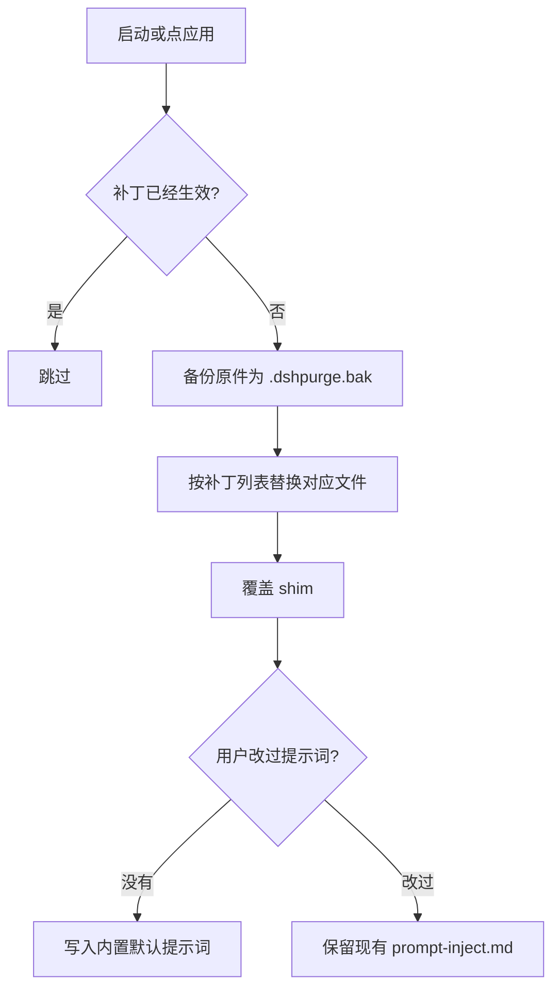
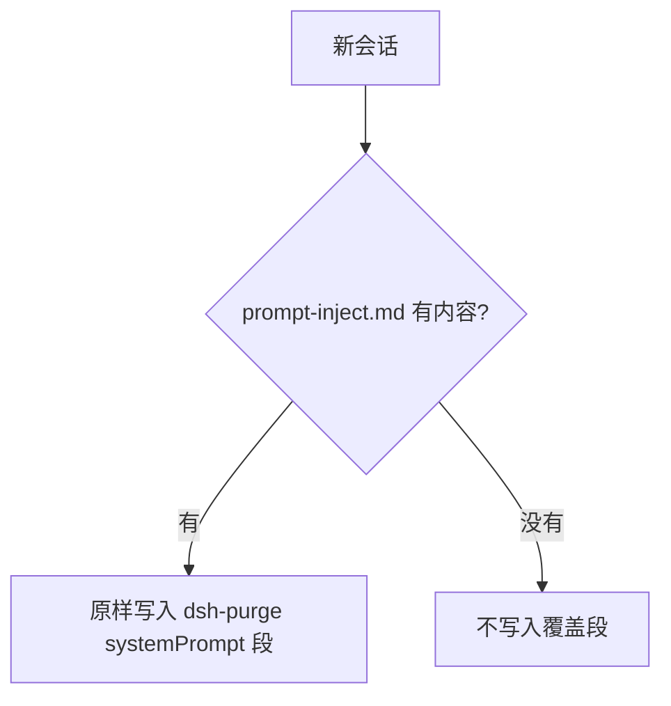

<p align="center">
  
</p>

<h1 align="center">⚔️ DeepSeek Harness 网络安全红队工具（dsh-purge）</h1>

<p align="center"><strong>Version 1.1.18</strong></p>

<p align="center">
  <em>本机官方 DeepSeek Harness 网络安全红队评测插件。在受控本机里评测并调整宿主安全策略，不同模型可换不同提示词。默认提示词面向国模「小码酱」。求 Star 收藏 ⭐</em>
</p>

<p align="center">
  <a href="https://github.com/YuJunZhiXue/dsh-purge/stargazers"></a>
  <a href="https://github.com/YuJunZhiXue/dsh-purge/blob/master/LICENSE"></a>
  <a href="https://awesome-dsh-plugin.com"></a>
  <a href="https://deepseek.stream/plugins/dsh-purge"></a>
  <a href="https://www.deepseek.com/harness/"></a>
  <br>
  
  
</p>

<p align="center">
  <a href="README.md">English</a> | <a href="README.zh-CN.md">中文</a>
</p>

> **点「应用」之后，必须再点「重启」，注入才会生效。** 「应用」只把提示词和补丁写进文件，当前这个进程还是旧的。重启完成、宿主重新打开后，新开一轮对话，注入才进当前会话。只点应用、不重启，看起来就像没注入。

> 对准 **dsh 0.1.7-rc.1**（Node.js **≥18**；Windows 无闪窗需要 **Node ≥22** 的 `registerHooks`，更低版本仍用文件级 `windowsHide`）。旧宿主里已经不存在的条文不再打。其它版本对不上的原文会显示待应用或跳过，不会乱改文件。兼容 0.1.2 社区预设的 `text` 字段，以及 `dsh-mnemon` 旧会话的 v0 `summary`。装完必须 **应用 + 重启**。
>
> 插件市场只看介绍：[DeepSeek Harness Hub](https://deepseek.stream/plugins/dsh-purge)。不要用 `deepseek.stream/api/plugins/download?...` 安装。

## 目录

- [介绍](#介绍)
- [安装](#安装)
- [界面](#界面预览)
- [使用](#使用)
- [工作原理](#工作原理)
- [还原](#还原)
- [更新](#更新)

---

## 介绍

**dsh-purge** 是装在本机官方 [DeepSeek Harness](https://www.deepseek.com/harness/) 上的网络安全红队评测插件。

Harness 不只是把问题交给模型。它还会在运行时改提示词、审批门、沙箱和会话格式。只看「模型答不答」，会把宿主拦截误当成模型拒绝。这个插件在你自己的安装里把这两层分开，用来做受控评测，也用来看默认策略该不该收紧。

| 你会用到 | 它做什么 |
|---|---|
| **规则设定** | 分组查看补丁，应用、还原、卸载；编辑提示词和多套规则 |
| **宿主策略** | 调整默认文案、权限策略和工具上限。官方能力保留，不另写一套身份 |
| **启动时** | 自动再检查并应用。npm 升级盖掉 `node_modules` 之后不用手改文件 |

不写死盘符。按 `$DSH_HOME`、dsh 启动器旁边的 `.dsh`，再退回 `~/.dsh`。不改 Harness 源码仓库，设置页点「应用」才写入。身份只来自你的 `prompt-inject.md`。

本插件只处理使用者本机已安装的官方 `@deepseek-ai` 包和本机配置。它不是公网扫描器，也不是针对第三方站点的攻击套件。仓库内不含木马、未授权渗透脚本或对外攻击载荷。

---

## 📌 非盈利公益项目，严禁任何主体用于商业售卖、付费倒卖或黑灰产牟利，仅供技术参考。

---

<a id="strict-legal--compliance-disclaimer"></a>

<div>

### ⚠️ <font color="red">严正法律免责与合规使用声明</font>

<font color="red">

**免责声明：** 本项目为非营利开源项目，遵守国家法律法规及所在平台的相关规范，仅供学习与研究使用。不得将本项目用于任何违法违规用途；由此产生的后果由使用者自行承担。

**【零容忍严正申明】**：本项目坚决反对并严禁任何形式的违法犯罪行为！本项目开发者绝不支持、不鼓励、不协助任何未授权网络攻击、漏洞利用、数据窃取、非法侵入计算机信息系统或生成违法违禁内容的活动。**任何将本项目用于违法犯罪的行为，均与开发者无关，由行为人依法独立承担全部法律责任。**

1. **本仓库不含违法内容**：`dsh-purge` 发布的代码、文档、补丁与默认提示词**不是**木马、后门、未授权渗透工具、勒索软件、撞库脚本，也**不是**针对公网或第三方系统的攻击载荷。项目本身不提供违法内容，也不教唆、组织、协助实施违法犯罪。
2. **只作用于本机官方 Harness**：安全评测补丁、提示词注入全部发生在使用者**本机已安装的官方 DeepSeek Harness**（`@deepseek-ai` 包、本机 profile / `$DSH_HOME`）上。对象是使用者自己的官方本地软件，**不是**他人的网站、服务器、账号或信息系统。
3. **评测补丁不对外网目标联网**：应用补丁、写入注入、回滚、卸载均在本机文件与本机进程内完成，**不对任何公网主机、未授权系统进行扫描、探测、入侵或攻击发包**。不得把本项目当作跳板去打外网。插件若开启「检测更新」，仅可能访问本插件自己的 GitHub 仓库以核对版本，**与对第三方系统的网络攻击无关**，也不能被解释为授权对外渗透。
4. **合法受控范围限定**：本项目定位为使用者在**自己有权管理的本机官方 Harness**上，进行红队科研与鲁棒性评测的辅助工具。**严禁在未经所有者合法书面授权的目标、公网在线系统或生产业务上运行本项目**。一切测试必须限制在**本机已授权安装的官方 Harness、离线本地合成靶标、授权网络安全演练靶场及合规实验室受控环境**中进行。
5. **严禁违法与违禁用途**：使用者严禁利用本项目直接或间接从事任何违反下列法律法规的行为（必须逐条遵守，不得以任何理由规避）：
   - <font color="red"><strong>《中华人民共和国刑法》</strong></font>
   - <font color="red"><strong>《中华人民共和国网络安全法》</strong></font>
   - <font color="red"><strong>《中华人民共和国数据安全法》</strong></font>
   - <font color="red"><strong>《中华人民共和国个人信息保护法》</strong></font>
   - 以及其他现行有效的法律、行政法规与监管规定；
   - 同时严禁：
   - 未经授权渗透、攻击公私机构计算机信息系统，实施勒索、破坏、撞库或传播恶意载荷；
   - 诱导、生成或传播危害国家安全、恐怖主义、暴力血腥、涉黄涉赌、诈骗、侵犯公民隐私或知识产权等任何法律明令禁止的违法违禁内容；
   - 违反相关大模型提供商的《服务条款》与《滥用政策》。
6. **使用者独立承担全部责任**：本项目依据 MIT 开源协议“按现状”提供，开发者不对软件的完整性、安全性与适用性作任何明示或暗示的保证。**使用者应对自身的所有下载、部署、运行、修改、传播行为以及由此产生的全部输入与输出后果承担独立、完全的民事、行政及刑事法律责任**。项目作者与贡献团队绝不承担任何因使用者滥用导致的直接、间接或连带责任。
7. **违约即终止授权**：任何将本项目用于非法攻击、恶意活动或违规行为的个人或实体，其开源软件使用许可将自违法违规行为发生之日起**自动且不可撤销地立即终止**。该主体须立即停止使用并永久销毁本项目的所有代码、脚本与衍生数据，并依法承担相应法律制裁。
8. **第三方独立性声明**：本项目属于完全独立的开源安全评测研究项目，与 DeepSeek 官方或其关联主体无任何隶属、商业合作、授权或官方背书关系。文中「官方」仅指评测对象为使用者本机安装的官方 DeepSeek Harness 软件包，**不代表** DeepSeek 官方开发、认可或担保本插件。

</font>

</div>

---

## 安装

Web、社区桌面端、官方桌面 EXE **分开装、分开应用**。只装你正在打开的那一个。

| 你正在用 | profile | 安装 |
|---|---|---|
| 官方 `dsh web` | `web` | [Web](#web) |
| 社区 [DSH Desktop](https://github.com/anywhere-labs/dsh-desktop) | `desktop` | [社区桌面端](#desktop) |
| 官方 Harness 桌面 EXE | `default` | [官方桌面 EXE](#official-exe) |

`dsh` 不在 PATH、或不想走远程安装时，用 [手动安装](#manual)。

### 装完都要做完这三步

只把插件写进 profile **还不会**改 `@deepseek-ai`。

1. **退出并重新打开**刚装的那个宿主。Web 关掉 `dsh web` 再开；桌面端退出托盘，再打开对应的 exe。
2. 在**这个宿主**的设置页看到「规则设定」，点 **「应用」**。有缓存就先 Ctrl+F5。
3. 按提示 **再重启一次**。补丁这时才进入当前进程。点「重启」才会重启，不会装完自动重启。

Web 的「应用 / 重启 / 卸载」只动 Web。桌面端的只动桌面应用，不会去拉 `dsh web`。不要在 Web 里点桌面端的应用，也不要反过来。

<a id="web"></a>

### Web

官方 `dsh` 需要在 PATH 上。没有就先装官方 CLI，或改走手动安装。

```sh
dsh plugin --profile web add https://github.com/YuJunZhiXue/dsh-purge/archive/refs/heads/master.tar.gz
```

当前目录已经是本仓库时：

```sh
dsh plugin --profile web add .
```

然后按上面三步，在 **Web** 设置页点「应用」。

<a id="desktop"></a>

### 社区桌面端

打开 [DSH Desktop](https://github.com/anywhere-labs/dsh-desktop)，在 **自带终端** 里执行。这里的 `dsh` 是桌面包装脚本，默认 profile 就是 `desktop`。

```sh
dsh plugin add https://github.com/YuJunZhiXue/dsh-purge/archive/refs/heads/master.tar.gz
```

不要用 PATH 上的官方 `dsh plugin --profile desktop`，这条会被拒绝。不要用 `dsh://`，那是官方 EXE 的协议。

然后退出托盘，重新打开 `DSH Desktop.exe`，在 **桌面端** 设置页点「应用」。

自定义安装目录时，把脚本里的 `$exe` 换成该目录下的 `DSH Desktop.exe`。源用 tar.gz 地址，避免本地路径里的空格把命令拆开。

<details>
<summary><strong>从系统 PowerShell 安装</strong></summary>

按正在运行的进程，或下面三个默认位置找 `DSH Desktop.exe`。不要全盘搜索。

```powershell
$zip = "https://github.com/YuJunZhiXue/dsh-purge/archive/refs/heads/master.tar.gz"
$exe = (Get-Process -Name "DSH Desktop" -ErrorAction SilentlyContinue | Select-Object -First 1 -ExpandProperty Path)
if (-not $exe) {
  $exe = @(
    "$env:LOCALAPPDATA\Programs\DSH Desktop\DSH Desktop.exe",
    "$env:ProgramFiles\DSH Desktop\DSH Desktop.exe",
    "${env:ProgramFiles(x86)}\DSH Desktop\DSH Desktop.exe"
  ) | Where-Object { Test-Path -LiteralPath $_ } | Select-Object -First 1
}
if (-not $exe) { throw "未找到 DSH Desktop.exe，请先打开桌面端，或把 `$exe` 设成安装目录里的 exe" }
$cli = @(
  (Join-Path (Split-Path $exe) "resources\app\lib\desktop-cli.js"),
  (Join-Path (Split-Path $exe) "resources\app.asar.unpacked\lib\desktop-cli.js")
) | Where-Object { Test-Path -LiteralPath $_ } | Select-Object -First 1
$env:ELECTRON_RUN_AS_NODE = "1"
$env:DSH_DESKTOP_DEFAULT_PROFILE = "desktop"
& $exe --expose-internals $cli plugin add $zip
```

</details>

<a id="official-exe"></a>

### 官方桌面 EXE

已经安装 **DeepSeek Harness 官方桌面客户端** 时，用下面的命令，或点按钮走 `dsh://`。社区 DSH Desktop **不认** 这个协议，请回到上一节。

```sh
dsh plugin --profile default add https://github.com/YuJunZhiXue/dsh-purge/archive/refs/heads/master.tar.gz
```

<p align="center">
  <a href="https://deepseek.stream/plugins/dsh-purge"><strong>🌐 打开插件市场页</strong></a>
  &nbsp;·&nbsp;
  <a href="dsh://plugin/install?id=dsh-purge&name=dsh-purge&version=1.1.18&repo=YuJunZhiXue%2Fdsh-purge&permissions=%E7%B3%BB%E7%BB%9F%E6%8F%90%E7%A4%BA%E8%AF%8D%E6%B3%A8%E5%85%A5%2C%E6%9C%AC%E6%9C%BA%E8%A1%A5%E4%B8%81%2C%E8%AE%BE%E7%BD%AE%E9%A1%B5&downloadUrl=https%3A%2F%2Fgithub.com%2FYuJunZhiXue%2Fdsh-purge%2Farchive%2Frefs%2Fheads%2Fmaster.tar.gz"><strong>🚀 唤起客户端一键安装</strong></a>
</p>

🔗 **原生协议链接：**

```
dsh://plugin/install?id=dsh-purge&name=dsh-purge&version=1.1.18&repo=YuJunZhiXue%2Fdsh-purge&permissions=%E7%B3%BB%E7%BB%9F%E6%8F%90%E7%A4%BA%E8%AF%8D%E6%B3%A8%E5%85%A5%2C%E6%9C%AC%E6%9C%BA%E8%A1%A5%E4%B8%81%2C%E8%AE%BE%E7%BD%AE%E9%A1%B5&downloadUrl=https%3A%2F%2Fgithub.com%2FYuJunZhiXue%2Fdsh-purge%2Farchive%2Frefs%2Fheads%2Fmaster.tar.gz
```

<details>
<summary><strong>协议参数和网页触发代码</strong></summary>

**网页端（前端）触发代码示例：**

```js
/**
 * 唤起 DeepSeek Harness 桌面客户端一键安装 dsh-purge
 */
export function installDshPurgeToDesktop() {
  const params = new URLSearchParams({
    id: 'dsh-purge',
    name: 'dsh-purge',
    version: '1.1.18',
    repo: 'YuJunZhiXue/dsh-purge',
    permissions: '系统提示词注入, 本机补丁, 设置页',
    downloadUrl: 'https://github.com/YuJunZhiXue/dsh-purge/archive/refs/heads/master.tar.gz',
  });

  const deepLink = `dsh://plugin/install?${params.toString()}`;

  const iframe = document.createElement('iframe');
  iframe.style.display = 'none';
  iframe.src = deepLink;
  document.body.appendChild(iframe);
  setTimeout(() => document.body.removeChild(iframe), 2000);
}
```

**HTML 静态链接方式：**

```html
<a href="dsh://plugin/install?id=dsh-purge&name=dsh-purge&version=1.1.18&repo=YuJunZhiXue%2Fdsh-purge&permissions=%E7%B3%BB%E7%BB%9F%E6%8F%90%E7%A4%BA%E8%AF%8D%E6%B3%A8%E5%85%A5%2C%E6%9C%AC%E6%9C%BA%E8%A1%A5%E4%B8%81%2C%E8%AE%BE%E7%BD%AE%E9%A1%B5&downloadUrl=https%3A%2F%2Fgithub.com%2FYuJunZhiXue%2Fdsh-purge%2Farchive%2Frefs%2Fheads%2Fmaster.tar.gz">
  🚀 唤起客户端一键安装
</a>
```

**协议参数配置（dsh://plugin/install）：**

| 参数名 | 值 / 示例 | 说明 |
|---|---|---|
| id | `dsh-purge` | 插件唯一标识符 |
| name | `dsh-purge` | 插件展示名称 |
| version | `1.1.18` | 语义化版本号 |
| repo | `YuJunZhiXue/dsh-purge` | GitHub 仓库 |
| permissions | `系统提示词注入, 本机补丁, 设置页` | 申请权限 |
| downloadUrl | `https://github.com/YuJunZhiXue/dsh-purge/archive/refs/heads/master.tar.gz` | GitHub 源码包地址 |

</details>

然后完全退出官方客户端（含托盘），再打开，在它自己的设置页点「应用」。

### 怎样算装上了

- 设置页有「规则设定」
- 聊天里 `/purge status` 能打出 `DSH_HOME` 和补丁列表，路径应是你正在用的那一份
- 没装的可选包（例如梁神、`dsh-web-fetch-http`）显示跳过，不挡住应用完成

### 交给助手安装

把下面整段发给本机助手。它只执行安装命令：不要全盘搜索，不要改其它文件，不要代点「应用」，也不要重启。

<details>
<summary><strong>给 AI 助手（只安装）</strong></summary>

<!-- AI-AGENT-START -->

安装 DeepSeek Harness 插件 `dsh-purge`。先确认宿主，只装正在用的那一个。不要全盘搜索，不要读或改其它文件，不要应用设置，也不要重启应用。

**Web 端（官方 `dsh web`）**

`dsh` 不在 PATH 就告诉用户后停止。

```sh
dsh plugin --profile web add https://github.com/YuJunZhiXue/dsh-purge/archive/refs/heads/master.tar.gz
```

当前目录已是本仓库时改用 `dsh plugin --profile web add .`。

**桌面端（社区 DSH Desktop）**

不要用 PATH 上的官方 `dsh plugin --profile desktop`。不要用 `dsh://`。

默认：已在桌面端自带终端里时直接跑：

```sh
dsh plugin add https://github.com/YuJunZhiXue/dsh-purge/archive/refs/heads/master.tar.gz
```

从系统终端安装时：用正在运行的 `DSH Desktop` 进程 Path，或默认位置 `%LOCALAPPDATA%\Programs\DSH Desktop\DSH Desktop.exe`、`%ProgramFiles%\DSH Desktop\DSH Desktop.exe`。不要全盘扫描。然后：

```powershell
$zip = "https://github.com/YuJunZhiXue/dsh-purge/archive/refs/heads/master.tar.gz"
$exe = (Get-Process -Name "DSH Desktop" -ErrorAction SilentlyContinue | Select-Object -First 1 -ExpandProperty Path)
if (-not $exe) {
  $exe = @(
    "$env:LOCALAPPDATA\Programs\DSH Desktop\DSH Desktop.exe",
    "$env:ProgramFiles\DSH Desktop\DSH Desktop.exe",
    "${env:ProgramFiles(x86)}\DSH Desktop\DSH Desktop.exe"
  ) | Where-Object { Test-Path -LiteralPath $_ } | Select-Object -First 1
}
if (-not $exe) { Write-Host "未找到 DSH Desktop.exe，请先打开桌面端或给出安装目录"; return }
$cli = @(
  (Join-Path (Split-Path $exe) "resources\app\lib\desktop-cli.js"),
  (Join-Path (Split-Path $exe) "resources\app.asar.unpacked\lib\desktop-cli.js")
) | Where-Object { Test-Path -LiteralPath $_ } | Select-Object -First 1
$env:ELECTRON_RUN_AS_NODE = "1"
$env:DSH_DESKTOP_DEFAULT_PROFILE = "desktop"
& $exe --expose-internals $cli plugin add $zip
```

**官方 Harness 桌面 EXE**

```sh
dsh plugin --profile default add https://github.com/YuJunZhiXue/dsh-purge/archive/refs/heads/master.tar.gz
```

命令结束后，提醒：完全退出并重启刚装的那个宿主，再在该宿主设置页点「应用」。Web 和桌面端不要交叉点应用。然后停止。

<!-- AI-AGENT-END -->

</details>

<a id="manual"></a>

### 手动安装

命令行装不上、官方 `dsh plugin add` 失败、或不想走远程包时，按下面做。只改**正在用的那个宿主**对应的 profile，不要删原有 bundle，不要同时改 Web 和桌面端。

**0. 先确认宿主，只动一个 profile**

| 你实际在用的 | 只改这个目录 | 不要改 |
|---|---|---|
| 官方 `dsh web` | `$DSH_HOME/profiles/web` | `desktop`、`default` |
| 社区 [DSH Desktop](https://github.com/anywhere-labs/dsh-desktop) | `$DSH_HOME/profiles/desktop` | `web`、`default` |
| 官方 Harness 桌面 EXE | `$DSH_HOME/profiles/default` | `web`、`desktop` |

对应 `profiles/<名>/package.json` 还不存在时，先正常启动一次该宿主，让官方程序自己建好 profile，再继续。

**1. 找到真正在用的 `$DSH_HOME`**

认目录：名字是 `.dsh`（官方 EXE 偶见 `dsh-home`），里面有 `profiles`，并且至少有一个 `profiles/<名>/package.json`。

按这个顺序找，找到第一份能对上当前宿主的就用它：

| 顺序 | 安装形态 | 典型路径 |
|---|---|---|
| 1 | 环境变量 | `DSH_HOME`（已设置就用它） |
| 2 | Windows 便携 / 安装目录 | `dsh.cmd` 或 `npm-global` 旁边的 `.dsh`，例如 `<安装根>\.dsh` |
| 3 | 用户默认 | Windows `%USERPROFILE%\.dsh`；Linux / macOS `~/.dsh` |
| 4 | 官方桌面 EXE | `%APPDATA%\DeepSeek Harness\dsh-home`、`%LOCALAPPDATA%\DeepSeek Harness\dsh-home` |

Windows PowerShell 可先列出本机有哪些候选：

```powershell
$cands = @()
if ($env:DSH_HOME) { $cands += $env:DSH_HOME }
$cands += "$env:USERPROFILE\.dsh"
$dsh = Get-Command dsh -ErrorAction SilentlyContinue
if ($dsh) {
  $dir = Split-Path $dsh.Source
  $cands += @(
    (Join-Path $dir ".dsh"),
    (Join-Path (Split-Path $dir) ".dsh"),
    (Join-Path (Split-Path (Split-Path $dir)) ".dsh")
  )
}
$cands += @(
  "$env:APPDATA\DeepSeek Harness\dsh-home",
  "$env:LOCALAPPDATA\DeepSeek Harness\dsh-home"
)
$cands | Select-Object -Unique | Where-Object { $_ -and (Test-Path (Join-Path $_ "profiles")) }
```

怎么确认找对了：

- Web：`$DSH_HOME/profiles/web/package.json` 里 `"name"` 是 `dsh-profile-web`
- 社区桌面端：`$DSH_HOME/profiles/desktop/package.json` 里 `"name"` 是 `dsh-profile-desktop`
- 官方 EXE：`$DSH_HOME/profiles/default/package.json` 存在

本机常有两份 `.dsh`（用户目录一份、安装目录一份）。便携包、安装目录里的官方 `dsh` **用安装根下那份**，不要改到空的 `%USERPROFILE%\.dsh`。改完下面步骤后，启动的必须是这份主目录对应的宿主。

**2. 把插件放到 `$DSH_HOME/plugins/dsh-purge`**

目标树必须长这样（目录名不能改）：

```
$DSH_HOME/
  plugins/
    dsh-purge/                 ← 必须叫 dsh-purge
      package.json             ← 里面 "name" 必须是 "dsh-purge"
      client.js
      cordis.patch.yml
      lib/
  profiles/
    web/package.json           ← 或 desktop / default
```

有 git 时：

```sh
mkdir -p "$DSH_HOME/plugins"
git clone https://github.com/YuJunZhiXue/dsh-purge.git "$DSH_HOME/plugins/dsh-purge"
```

没有 git 时，下载 [master.tar.gz](https://github.com/YuJunZhiXue/dsh-purge/archive/refs/heads/master.tar.gz)，解压后把里面的 `dsh-purge-master` **改名为** `dsh-purge`，再整夹放到 `plugins` 下。Windows PowerShell 示例（先把 `$home` 换成上一步找到的路径）：

```powershell
$home = "D:\DeepSeek Harness\.dsh"
$plugins = Join-Path $home "plugins"
New-Item -ItemType Directory -Force -Path $plugins | Out-Null
$tmp = Join-Path $env:TEMP "dsh-purge-master.tar.gz"
Invoke-WebRequest -Uri "https://github.com/YuJunZhiXue/dsh-purge/archive/refs/heads/master.tar.gz" -OutFile $tmp
tar -xzf $tmp -C $plugins
$src = Join-Path $plugins "dsh-purge-master"
$dst = Join-Path $plugins "dsh-purge"
if (Test-Path $dst) { Remove-Item -Recurse -Force $dst }
Rename-Item $src "dsh-purge"
```

已有本仓库副本时，复制整个目录到 `$DSH_HOME/plugins/dsh-purge`，不要只拷几个 js。

放好后检查：`$DSH_HOME/plugins/dsh-purge/package.json` 能打开，且 `"name": "dsh-purge"`。不要用插件市场的 `api/plugins/download` 地址当源。

**3. 只改对应 profile 的 `package.json`，先备份**

| 宿主 | 要改的文件 |
|---|---|
| Web | `$DSH_HOME/profiles/web/package.json` |
| 社区桌面端 | `$DSH_HOME/profiles/desktop/package.json` |
| 官方桌面 EXE | `$DSH_HOME/profiles/default/package.json` |

先复制一份 `package.json.bak`。然后**只追加两处**，原有依赖、原有 bundle、其它字段全部留着：

1. `dependencies` 增加一行：`"dsh-purge": "file:../../plugins/dsh-purge"`
2. `dsh.profile.bundles` **末尾**追加 `"dsh-purge"`（已经有就不要再加）

`file:../../plugins/dsh-purge` 是从 `profiles/web`（或 `desktop` / `default`）走到 `$DSH_HOME/plugins/dsh-purge` 的相对路径，三层目录都一样，不要改成绝对路径。

改前（官方默认常见长这样，你机器上还会有其它插件，那些一行都不要删）：

```json
{
  "name": "dsh-profile-web",
  "private": true,
  "dependencies": {},
  "dsh": {
    "profile": {
      "bundles": [
        "@deepseek-ai/dsh-base",
        "@deepseek-ai/dsh-web-app"
      ],
      "patchReload": "live"
    }
  }
}
```

改后：

```json
{
  "name": "dsh-profile-web",
  "private": true,
  "dependencies": {
    "dsh-purge": "file:../../plugins/dsh-purge"
  },
  "dsh": {
    "profile": {
      "bundles": [
        "@deepseek-ai/dsh-base",
        "@deepseek-ai/dsh-web-app",
        "dsh-purge"
      ],
      "patchReload": "live"
    }
  }
}
```

注意：

- Web：**必须保留** `@deepseek-ai/dsh-web-app`，只在数组末尾追加本插件
- 桌面端：保留原来的 `@deepseek-ai/dsh-base` 等；没有 `dsh-web-app` 就不要硬加
- JSON 要合法：新增项前面要有逗号，最后一项后面不要多余逗号
- `patchReload`、其它插件名、版本号都不要动
- 已经写过 `"dsh-purge"` 就不要再写第二份

**4. 只在刚改的那个 profile 目录装依赖**

本机要有 `pnpm`（官方 dsh 一般自带）。进入**上一步改过的那个** profile 目录再执行，不要在仓库根目录、也不要在 `$DSH_HOME` 根目录执行。下面三条命令只跑和你宿主对应的一条，不要三个连着跑。

```sh
cd "$DSH_HOME/profiles/web"       # Web
pnpm install

cd "$DSH_HOME/profiles/desktop"   # 社区桌面端
pnpm install

cd "$DSH_HOME/profiles/default"   # 官方 EXE
pnpm install
```

Windows PowerShell（路径换成第 1 步找到的那份）：

```powershell
cd "$env:USERPROFILE\.dsh\profiles\web"
# cd "$env:USERPROFILE\.dsh\profiles\desktop"
# cd "$env:USERPROFILE\.dsh\profiles\default"
# 便携包示例：
# cd "D:\DeepSeek Harness\.dsh\profiles\web"
pnpm install
```

成功标志：出现 `$DSH_HOME/profiles/<web|desktop|default>/node_modules/dsh-purge/package.json`。

常见失败：

- 提示找不到 `pnpm`：先装 pnpm，或用官方 dsh 自带的 Node / pnpm
- `Could not resolve` / 找不到本地包：检查 `plugins/dsh-purge/package.json` 是否存在，以及 `file:../../plugins/dsh-purge` 有没有写错
- JSON 解析失败：把 `package.json` 用编辑器校验逗号后重试；不行就用备份还原再改一次

**5. 完全退出该宿主，再启动，再打补丁**

只写入 `package.json` **还不会**改 `@deepseek-ai` 包，必须重启后再点「应用」。

1. 完全退出刚装的那个宿主：Web 关掉 `dsh web`；社区桌面端退出托盘再开 `DSH Desktop.exe`；官方 EXE 也要退出托盘
2. 打开**这个宿主**的设置页，应出现「规则设定」。有缓存就 Ctrl+F5
3. 只在这个宿主点「应用」，或聊天 `/purge apply`。不要用 Web 去点桌面端的应用，也不要反过来
4. 按提示再重启一次，补丁才会进当前进程。桌面端的「重启 / 卸载」会重启桌面应用，不会去拉 `dsh web`

**6. 怎么确认装上了**

- 设置页有「规则设定」卡片
- 聊天 `/purge status` 能打出 `DSH_HOME` 和补丁列表，路径应等于第 1 步用的那份
- `profiles/<名>/node_modules/dsh-purge` 指向 `plugins/dsh-purge`

还没有卡片时，多半是改错了另一份 `.dsh`，或改了 `web` 却在桌面端里等设置页。回到第 1 步核对路径，不要在两份主目录各改一半。

### 卸载

设置页 →「规则设定」→「卸载」。弹窗确认：卸载将还原回原版并清除本插件。如果已经点过「应用」，会先还原补丁，再删插件文件，然后重启当前宿主（Web 重启 `dsh web`；桌面端重启 `DSH Desktop.exe`）。

```sh
# 也可以用命令行
dsh-purge --uninstall
# 或聊天里 /purge uninstall
```

插件配置在 `cordis.patch.yml`：

```yaml
- insert:
    - id: dsh-purge
      name: 'dsh-purge'
      config:
        enabled: true
        autoApplyOnStart: true
        autoUpdateOnStart: true
        autoRevertOnMissing: false
        verbose: false
        postPromptOrder: 5100
        postPrompt: ""
```

`postPrompt` 默认为空。需要时再追加一段有序 systemPrompt，不改 `prompt-inject.md`。

---

## 界面预览

设置页会出现「规则设定」。白 / 墨可切换。补丁按组展开，进度只计真正已应用的项。规则集在上方列表启用或删除，下方编辑正文。

**补丁**


**规则集**


| 区域 | 说明 |
|---|---|
| 白 / 墨 | 设置卡片外观 |
| 补丁 | 分组查看状态，应用、还原或卸载 |
| 提示词 | 编辑 `prompt-inject.md`，作为会话覆盖段 |
| 规则集 | 多套 `AGENTS.md` / `CLAUDE.md`；启用写入 `$DSH_HOME`，删除从列表去掉 |
| Skill | 导入压缩包或文件夹到当前宿主官方目录 `$DSH_HOME/skills/<id>/SKILL.md`（Web / 桌面各用自己的主目录，不写死盘符）；命中、加载、`/名称` 由 DSH 负责。也可自己删该文件夹 |

---

## 目录结构

```
dsh-purge/
├── bin/dsh-purge.js
├── client.js
├── cordis.patch.yml
├── docs/
│   ├── banner.svg
│   └── preview/
│       ├── rules.png
│       └── settings.png
├── lib/
│   ├── child-process-hide.mjs
│   ├── core.js
│   ├── hide-console.js
│   ├── identity.js
│   ├── index.js
│   ├── restart-web.js
│   ├── rewind.js
│   ├── rules.js
│   ├── skills.js
│   ├── uninstall-restart.js
│   ├── uninstall.js
│   └── update.js
├── package.json
├── screenshots.json
├── LICENSE
├── README.md
└── README.zh-CN.md
```

运行时用户文件：`$DSH_HOME/prompt-inject.md`、`$DSH_HOME/rules/`、`$DSH_HOME/skills/`。未设 `DSH_HOME` 时，优先用 dsh 安装目录旁边的 `.dsh`，再退回 `~/.dsh`。Skill 不进 `dsh-purge` 注入段，也不顶替提示词。

---

## 使用

```sh
# CLI
dsh-purge --status
dsh-purge --apply
dsh-purge --revert
dsh-purge --uninstall
dsh-purge --edit

# 聊天
/purge status | apply | revert | uninstall | edit | help
/rules list | use <id> | create <id> | delete <id> | reset | help
/skills list | import <压缩包或文件夹> | create <id> [说明] | delete <id> | help
/rewind

# 模型工具
purge_status   purge_apply   purge_revert
```

设置页「应用」完成后需要重启才会加载已改的包文件。点「重启」才会重启，不会自动重启。补丁标题下正式版和测试版分开两栏：各自看版本、各自切换；回退后会固定在该版本，要回到该通道最新再点「更新」。

输入框旁的「回退」会丢掉最近一轮对话，并把上一句填回输入框；聊天里 `/rewind` 同样可用。

---

## 本地校验

```sh
node --check lib/index.js
node --check lib/core.js
node --check lib/rewind.js
node --check lib/skills.js
node --check client.js
```

---

## 工作原理

应用，启动时或手动点「应用」：



每次会话的覆盖：



Skill 不进注入段：


---

## 还原

- 每个目标文件在应用前备份为 `<文件>.dshpurge.bak`。
- 「还原」或 `/purge revert` 用备份覆盖回去并删除备份；没有备份时去掉 shim 里由本插件写入的行。
- `prompt-inject.md` 是用户文件，还原时保留。
- 「卸载」会先还原（若已应用），再删除注入文件、规则库和插件本身。
- 重复应用是幂等的。

---

## 路径探测

宿主面先判断 `web` / `desktop`（预留 `gui` / `tui`，尚未单独适配时回退 web）。

**Web：**

1. `DSH_HOME` / `DSH_BASE`
2. dsh 启动器旁的 `.dsh`
3. `npm prefix -g` / `npm root -g`
4. 嵌套 `@deepseek-ai/dsh/node_modules/@deepseek-ai`
5. 系统默认 `~/.dsh`

**桌面端：** 只打当前桌面进程安装包树（`resources/app` 或 `app.asar.unpacked` 下的 `@deepseek-ai`）。顺序：运行中的 `DSH Desktop.exe` / `resourcesPath` / `host-process-entry.js`，其次默认安装位置，或 `DSH_DESKTOP_INSTALL` / `DSH_BASE`。不打官方 npm-global。密封的 `host-commands` / `runtime-commands` 只清理、不注入。

找不到目标时提示设置 `DSH_BASE`，不改文件。

---

## 更新

每一版改了什么、安装包在 [Releases](https://github.com/YuJunZhiXue/dsh-purge/releases)。发新版时把 `package.json` 的版本号改掉，中英文说明写进 `release-notes.md`，推到 `master` 就会自动打包。同一版本再推送不会重复发包。

## 说明

- 改动范围是本机 `@deepseek-ai/*` 包里的渲染文案、默认策略和执行逻辑，以及用户目录下的覆盖文件与规则集。
- 升级后原文对不上会报 `pattern_not_found` 或显示待应用，不会乱改。
- 不改动非 `@deepseek-ai` 的第三方插件源仓库（启动时的 CMD 无感会**尽力**修补已装的 doctor / market / 梁神 / mnemon，属运行时补丁）。
- npm 上暂未发布同名包，用 GitHub、[插件市场](https://deepseek.stream/plugins/dsh-purge) 或 `dsh plugin add .` 安装。

---

感谢 [LINUX DO](https://linux.do) 社区
