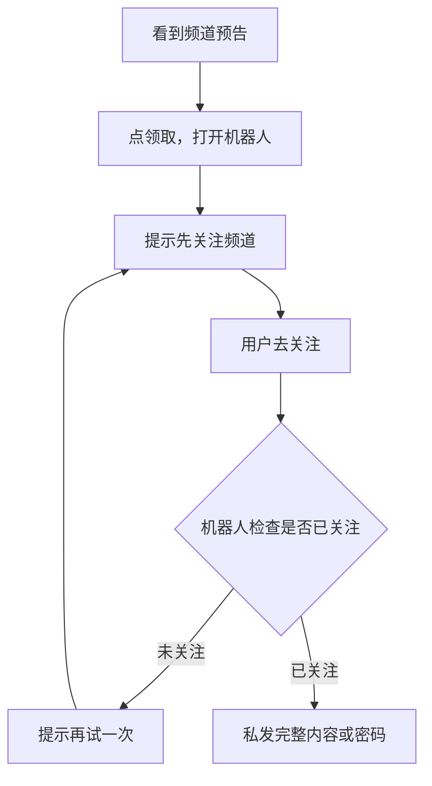

# 方案 A：关注频道后私发完整内容

频道只发预告。用户点按钮进入机器人，机器人检查是否已加入 [@LLM_PoJia](https://t.me/LLM_PoJia)，通过后把正文或密码发到私聊。

## 用户路径



## 你在频道里做什么

- 标题要能停住滑动，正文只放一半思路或一张效果图。
- 文末放领取链接，不要把密码写在评论或下一篇。
- 置顶一条「怎么领取」，减少重复问。

领取链接格式：

```text
https://t.me/机器人用户名?start=本期编号
```

例如：`https://t.me/LLM_PoJia_Bot?start=20260917`

## 机器人对用户说什么

| 情况 | 怎么回 |
| --- | --- |
| 未关注 | 给关注按钮，再给「我已关注，重新检查」 |
| 已关注 | 直接发正文，可附带下一期预告 |
| 取关后再来 | 提示需要重新关注，不要骂人、不要拉黑示威 |

## 频道预告模板

> 今天这条把某某模型的破甲路径拆开了。这里只放前两步和一张效果图。完整步骤和可用提示词在机器人里，关注本频道后点下面领取。

## 落地步骤

### 1. 用 BotFather 建机器人

1. 打开 [@BotFather](https://t.me/BotFather)，发送 `/newbot`。
2. 显示名用好认的，例如「破甲领取」。
3. 用户名尽量和频道近，例如 `LLM_PoJia_Bot`（被占用就换相近的）。
4. 把 Token 只存在自己电脑或服务器，不要发到频道、群、截图。
5. `/setdescription`：关注频道后在这里领取完整内容。
6. `/setabouttext`：放 `https://t.me/LLM_PoJia`。
7. `/setuserpic`：头像和频道一致，少被当陌生号。
8. `/setcommands` 建议写成：
   - `start` — 开始领取
   - `unlock` — 重新检查关注
   - `help` — 使用说明
9. `/setjoingroups` 选 Disable，避免别人把机器人拉进陌生群。

### 2. 频道侧

1. 频道管理员里加上这个机器人，**必须是管理员**，否则检查订阅不稳定。
2. 它不必有「发消息」权限，除非你打算让它代发频道帖。
3. 简介写清主题、更新频率、领取入口。
4. 置顶一条「怎么领取」。
5. 频道帖只放钩子 + 大约两成预览 + 领取链接。

### 3. 内容和测试

1. 完整步骤、提示词、密码只放机器人里。
2. 机器人发出的正文尽量开「保护内容」，减少被转发白嫖。
3. 用第二个 Telegram 账号测三遍：未关注不发、已关注才发、取关后再点会拦截。
4. 机器人要 24 小时在线。断线时用户会以为活动是假的。

## 检查订阅怎么做到

机器人必须是频道管理员。用户点过「开始」之后，机器人才能拿到这个人的用户 ID，再用官方接口 `getChatMember` 查他是否还在频道里。

官方说明：[Telegram Bot API · getChatMember](https://core.telegram.org/bots/api#getchatmember)

判定可以这样记：

- 算已关注：`member` / `administrator` / `creator`
- 算未关注：`left` / `kicked`
