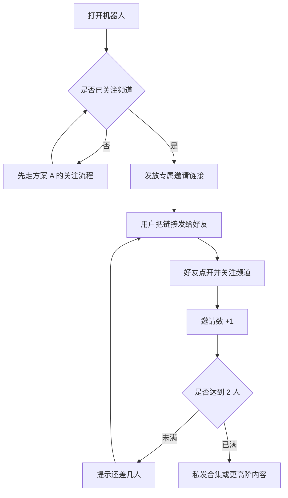

# 方案 B：邀请好友后领取更高阶内容

每个人有一条只属于自己的链接。好友必须「打开机器人 + 关注频道」才算有效邀请。满 2 人自动发奖，不要人工发密码。

先把 [方案 A](01-方案A-关注解锁.md) 跑通，再做这一套。邀请建立在「已经关注」之上。

## 用户路径



专属链接长这样：

```text
https://t.me/机器人用户名?start=ref_用户ID
```

这是「请好友来关注」，不是「去别人群里转发频道帖」。

## 规则为什么这样定

| 规则 | 为什么 |
| --- | --- |
| 先关注，再邀请 | 否则邀请来的人对频道没印象，粉是虚的 |
| 有效 = 点链接且关注 | 只点开不算，避免刷假进度 |
| 门槛 2 人 | 现在大约 1400 订阅，门槛太高会劝退 |
| 自己邀请自己不计 | 最基础的防刷 |
| 奖励用合集，不用本期 | 本期用方案 A 发，邀请用来冲总量 |

## 落地步骤

1. 先把方案 A 跑通，不要单独做邀请制。
2. 门槛先定 **2 人**，不要一上来 5 人以上。
3. 准备一张用户表，至少包含：
   - 用户 ID
   - 邀请人
   - 有效邀请数
   - 是否已领奖
4. 有效邀请定义：好友必须打开机器人 **并且** 关注频道，缺一不可。
5. 防刷：自己邀请自己不计；同一账号只算一次；对方取关后可扣回。
6. 进度话术当场说清，例如：「已邀请 1/2，还差 1 人。」
7. 满员立刻自动私发，不要你在后台一个个审。
8. 奖励分层：关注得本期，邀请得往期合集。不要把所有内容都锁在邀请后面。
9. 用两个真实号互测归因：B 点 A 的链接，A 的计数是否 +1。
10. 合集必须真的值，否则邀请会变成抱怨，不叫增长。
11. 机器人要 24 小时在线。

## 进度话术模板

未满员：

> 你的专属邀请链接：
> `https://t.me/机器人用户名?start=ref_123456`
>
> 当前进度：1 / 2。好友需要打开机器人并关注频道才算有效。满 2 人后自动发送往期合集。

已满员：

> 已满 2 人。往期合集如下（请勿外传到群，以免失效）。
