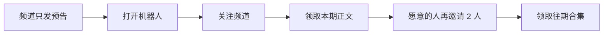

# 推荐组合与完整清单

两套方案可以一起用，但不要并行一把梭。

- 第一周：只做方案 A，关注后领本期。
- 第二周：再加上方案 B，邀请 2 人领往期合集。

## 推荐组合

不要把所有内容都锁在邀请后面。

## 两套共用准备

- [ ] 决定托管：自己写代码用一台常开电脑或小 VPS；不会写就用现成「强制关注」机器人平台
- [ ] 频道帖按钮用 `https://t.me/机器人用户名?start=本期编号`，方便以后看哪篇转化高
- [ ] 固定更新节奏，例如每周 3 更，比某周连发 10 条然后消失更有用
- [ ] 先小范围试 1 周，看领取率、取关率，再决定要不要上邀请

## 方案 A 清单

- [ ] 用 [@BotFather](https://t.me/BotFather) 发送 `/newbot`，起显示名（如「破甲领取」）和用户名（如 `LLM_PoJia_Bot`）
- [ ] 保存 Bot Token，只放在自己电脑或服务器，不要发到频道或群里
- [ ] `/setdescription` 写清：关注频道后在这里领取完整内容
- [ ] `/setabouttext` 放频道链接 https://t.me/LLM_PoJia
- [ ] `/setuserpic` 放和频道一致的头像
- [ ] `/setcommands` 设置 `start` / `unlock` / `help`
- [ ] `/setjoingroups` 选 Disable，避免别人把机器人拉进陌生群
- [ ] 频道管理员里添加该机器人，保留管理员身份（检查订阅必须）
- [ ] 机器人在频道里不必开「发消息」权限，除非你打算让它代发频道帖
- [ ] 准备一篇预告模板：钩子 + 两成预览 +「完整内容点机器人」
- [ ] 完整正文只放机器人里，频道帖不要出现密码或全文
- [ ] 频道简介和置顶消息都写：完整内容找 @你的机器人
- [ ] 用第二个 Telegram 账号走一遍：未关注 / 已关注 / 取关后再点
- [ ] 机器人发出的完整内容开启保护内容（禁止转发），减少白嫖外泄

## 方案 B 清单

- [ ] 先把方案 A 跑通，邀请制建立在「已关注」之上，不要单独做
- [ ] 门槛先设 2 人，不要一上来 5 人以上
- [ ] 每人生成专属链接：`https://t.me/机器人?start=ref_用户ID`
- [ ] 准备一张用户表：用户 ID、邀请人、有效邀请数、是否已领奖
- [ ] 有效邀请定义：好友必须打开机器人 + 关注频道，缺一不可
- [ ] 防刷：自己邀请自己不计；同一账号只算一次；取关后可扣回
- [ ] 进度话术：已邀请 1/2，差 1 人。满员立刻私发，不要人工审核
- [ ] 奖励分层：关注得本期，邀请得往期合集
- [ ] 用两个真实号互测归因：B 点 A 的链接，A 的计数是否 +1
- [ ] 机器人要 24 小时在线，断线用户会以为活动是假的

## 不要做

- 逼用户把帖子转发到多个群才给密码
- 让用户把机器人拉进陌生群当「已转发」凭证
- 频道正文直接放完整内容，再另发一个「假密码」装神秘
- 买粉、假抽奖、进群群发广告

相关说明：[Telegram 反垃圾](https://telegram.org/faq_spam)、[机器人开发者条款](https://telegram.org/tos/bot-developers)
